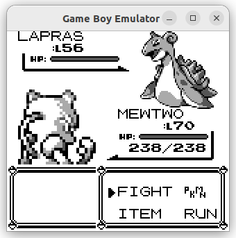
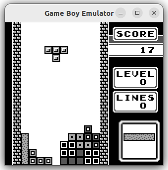

# GoEmulate
Game Boy Emulator in Go

GoEmulate is an emulator for the original Game Boy (DMG) written entirely in Go, utilizing the [pixel](https://github.com/faiface/pixel) library for graphics and [Oto](https://github.com/ebitengine/oto) for sound. The goal of the project is to reach basic emulator functionality with minimal code complexity, and very little focus on UI or useability.

Currently no support is planned for GBC/GBA emulation

Note: this is a learning project, and the first emulator I have written. The code was heavily influenced by all the projects listed below as development resources and I encourage you to use them directly.

Features
---

- Run most ROM only, MBC1, MBC3, and MBC5 cartridge types that I have tried, though Donky Kong has issues
- Save RAM to a ".ram" file
- Optionally skip Boot ROM (default)
- Save and recall CPU state
- Speed Up / Fast-Forward


Sample Screenshots:





Emulator Controls
---

Key         | Action
------------|----------
 X          | Game Boy "A" button
 Z          | Game Boy "B" button
 S          | Game Boy "Select" button
 Enter      | Game Boy "Start" button
 Arrow keys | Game Boy Joypad directions
 P          | Write contents of RAM to file
 \+         | Increase emulation speed (Up to 10x)
 \-         | Decrease emulation speed
 1          | Save CPU state
 Shift+1    | Recall CPU state


Setup
-----
Per pixel requirements https://github.com/faiface/pixel#requirements
```
sudo apt install libgl1-mesa-dev
sudo apt install xorg-dev
```


To Do List
----------
- other cartridge types
- more unit tests
- better error handling
- allow loading files from GUI or similar
- implement serial

Completed Tasks
- CPU save states
- longer compare with goboy
- access registers by enum
- window scaling
- MBC3 cartridge type
- code cleanup/resolve todos
- implement sound
- RAM saving
- reorganize into packages
- fix display bug with window over background
- Speed up
- allow loading files from cmd line argument


Development Resources
---
Other emulators used for comparison
- (go) https://github.com/Humpheh/goboy
- (java) https://github.com/trekawek/coffee-gb
- (rust) https://github.com/Gekkio/mooneye-gb
- (c) https://github.com/AntonioND/giibiiadvance

Game Boy docs:
- https://izik1.github.io/gbops/index.html
- http://bgb.bircd.org/pandocs.htm#cpuinstructionset
- http://marc.rawer.de/Gameboy/Docs/GBCPUman.pdf
- https://gbdev.io/pandocs/Specifications.html
